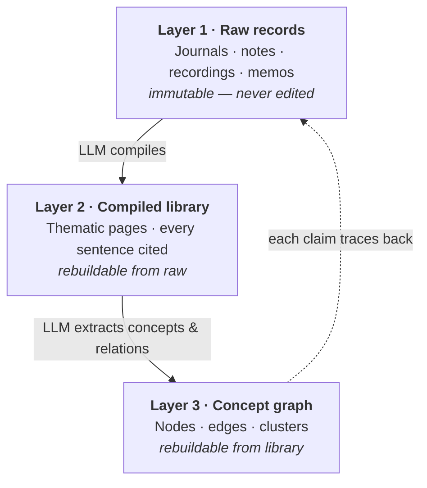
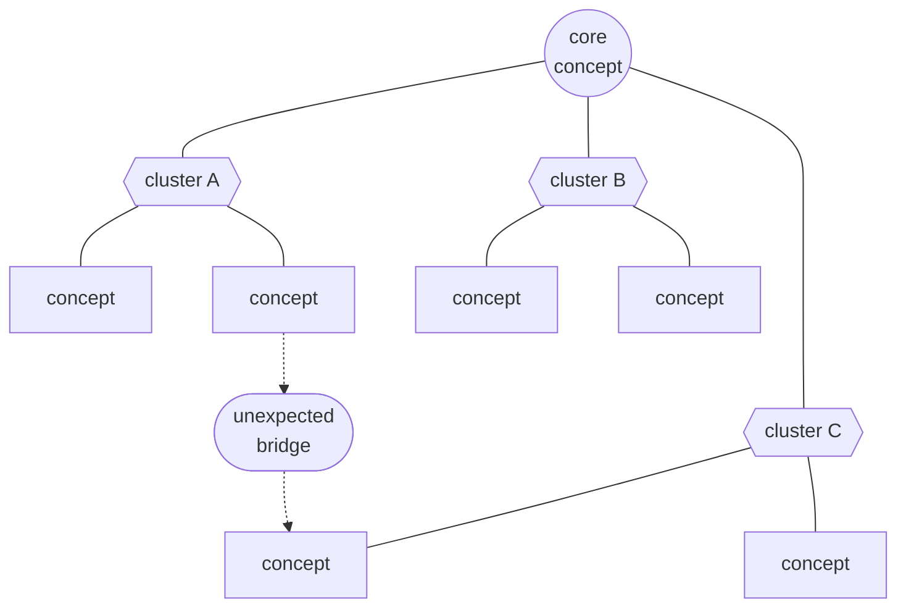

# 01 · Architecture — Three Houses

A technical system, described without technical vocabulary.

## The three layers

### Layer one — the room of raw material

A lifetime's worth of meditation notes, journals, lecture transcripts, voice recordings, and scattered memos — kept exactly as they were written. Read, but never modified. The system treats raw records as sacred; they are the only thing that can never be wrong.

### Layer two — the organized library

An LLM reads across the raw material and compiles it into a small number of thematic pages — perhaps a few dozen — each one threading together what the subject said about a given concern across many years. Every compiled sentence carries its source citation. The original can always be re-opened.

### Layer three — the map of connection

The LLM reads its own library and extracts concepts and the relationships between them. These become a graph — hundreds of nodes, hundreds of edges. Ideas from unrelated thematic pages suddenly turn out to be neighbors. The graph is the system's most surprising artifact.

## The data flow is one-directional

The raw layer is never rewritten. The two upper layers can be regenerated at will. When something is wrong in the compiled view, the answer is not to patch the compilation — it is to discard it and compile again. This invariant is what allows the system to be trusted.

## What the compiled graph tends to look like

A concept graph built from a single person's records, after the LLM has read everything and extracted entities and relations, has the topology of a small social network — a few high-degree hub concepts surrounded by dense local clusters, with occasional bridge edges connecting domains that the subject kept in different folders.

The dotted bridge edge is often the most interesting finding — a connection the subject never explicitly drew, sitting there in the graph because the language of the two concepts overlapped across years of separate writing.

---

## A note on lineage — 'Second Brain' and before

This system is not a new invention. It is the latest shape of an older impulse — the externalization of personal memory into a structure the self can consult later.

In the 1960s the German sociologist Niklas Luhmann built the **Zettelkasten**, a card archive of ninety thousand interlinked notes that served him for a lifetime of research.

More recently, *Building a Second Brain* (Tiago Forte, 2022) popularized the practice of storing personal knowledge in networked digital notes — across Roam, Obsidian, Notion, and their descendants.

### What is new

Traditional Second Brains store and retrieve; the human still reads, sorts, and connects. The system described here **reads and connects on the human's behalf** — thousands of pages of raw material, compressed into thematic pages, then again into a graph of concepts.

Compilation and synthesis, not just storage, are now externalized.

Call it, if you like, **Second Brain, next generation** — externalized memory that also externalizes the act of reading one's own memory. What this buys and what it costs is the subject of the rest of this document.

---

→ Next: [02 · Patterns the system can surface](./02-patterns.md)
