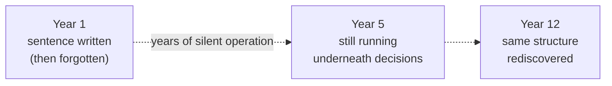
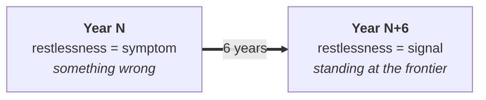
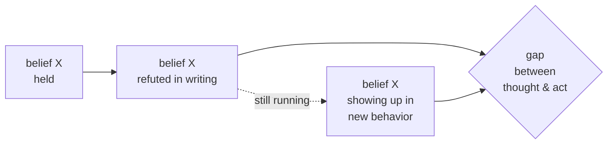
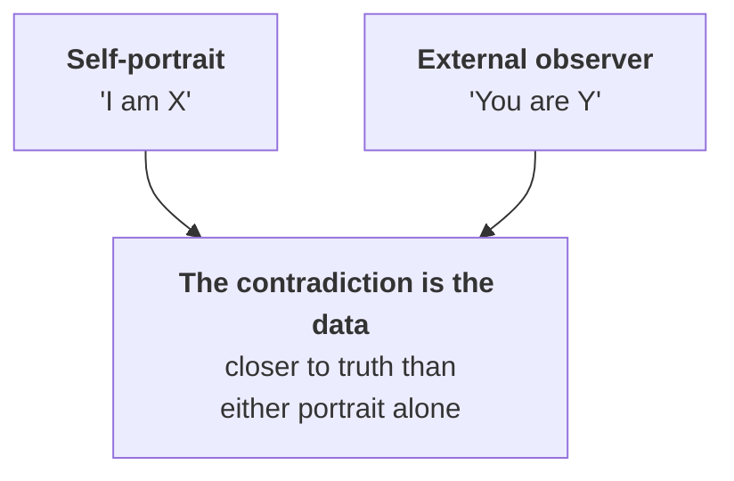
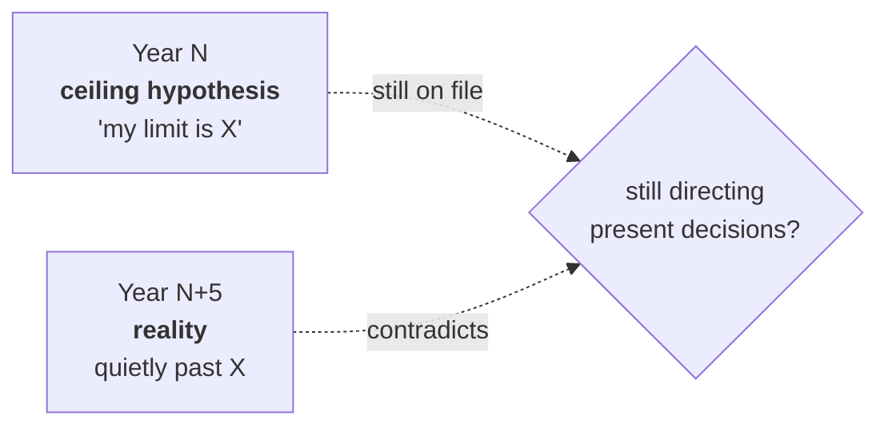

# 02 · Patterns the system can surface

The system is deployed against one person's records — whoever has built it. What follows are templates of the kind of pattern such a system tends to find in practice, stripped of any individual's details.

---

## Pattern one — a sentence that survives decades

**Structural self-descriptions written early in life often persist, nearly unchanged, for many years.**

A person writes, at twenty-five, a short self-diagnosis — three phrases, perhaps, naming the recurring hungers their life is built around. They forget this sentence.

Twelve years later the same person writes, in different words, about the same three hungers.

The system notices, because the keywords drift only a little while the structure stays stable. A single such finding may be the most truthful long-range portrait one can have of oneself.

---

## Pattern two — the same feeling, oppositely diagnosed

**A single emotion can be read as symptom at one point and as signal at another.**

Restlessness, in one year's diary, is named as a problem — a leak of attention, a cost of unresolved fear. Six years later the same person calls the same feeling *evidence of standing at the frontier*.

The emotion has not changed; the interpretation has flipped.

The system can lay the two sentences beside each other and produce a map of that change. Growth, here, is legible not as a feeling but as a 180-degree inversion in the interpretive stance.

---

## Pattern three — a belief overturned in writing

**Beliefs one has explicitly refuted sometimes keep running in the background.**

At some point the person writes, with conviction: *"I used to believe X, and I now see X is false for me."* This is a small but real philosophical event.

The system keeps the refutation. Years later it can check: does the refuted belief keep appearing in new behavior?

Most often the answer is partial — the belief is named as false while still operating as true. The system can show the gap.

---

## Pattern four — external observation meeting self-image

**A trusted observer's remark, pinned to a date, can be held against the subject's own self-description from other years.**

Teachers, therapists, partners, longtime friends — their sharp remarks tend to be preserved in notes, because the subject was trying to remember them.

The system can retrieve such a remark and place it beside the subject's own self-portrait from a different year. The two frequently disagree.

The contradiction is the data. Neither portrait alone is the whole person; the contradiction is closer.

---

## Pattern five — a ceiling that has been exceeded but never erased

**Old self-assessments of personal limits often remain on file after the limit has been surpassed.**

A person writes, in a private note, a sober estimate of their own ceiling — the highest place they realistically expect to reach. Years later reality has quietly walked past this line.

The note, however, is still on file, unrevised.

The system can retrieve it and place it beside current reality. The question it poses is not celebratory; it is practical: *to what extent is this obsolete estimate still directing present decisions?* Old estimates often keep working silently.

---

→ Next: [03 · Contributions to self-reflection](./03-contributions.md)
