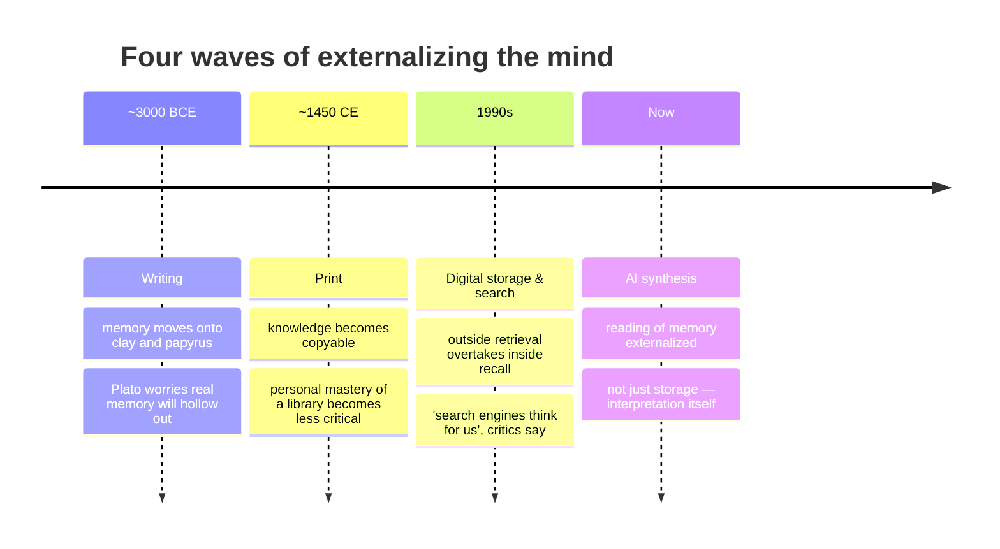

# 05 · The wider context — the automation of intelligence

What this system does is not peculiar to spiritual life. It is a local instance of a much larger shift: a redefinition of which parts of what we have called *thinking* can be done by machines.

This chapter places the system in that longer story.

---

## The fourth wave of externalization

Human beings have externalized mental operations before. The present moment is not the beginning; it is the fourth of an uneven series.

| When | Wave | What was externalized |
|------|------|----------------------|
| ~3000 BCE | **Writing** | Memory, until then an oral faculty, moves onto clay and papyrus. Plato warns, in the *Phaedrus*, that writing will hollow out real memory. He is partly right. |
| ~1450 CE | **Print** | Knowledge becomes copyable and distributable. Personal mastery of a library becomes less critical; locating a book becomes a skill; memorization gives way to reference. |
| 1990s | **Digital storage and search** | After the web, calling information up from outside is faster than calling it from inside. Search engines will think on our behalf, critics say. Again, partly right. |
| **Now** | **AI synthesis** | The prior three externalized *storage* and *retrieval*. The new difference is that **synthesis and interpretation themselves are now externalized** — not just memory, but the reading of memory. |

Each wave drew a similar complaint: this time, people will grow less capable; real knowing will be lost. In every case the answer turned out to be partial — people changed, but did not disappear. Each wave redefined the question of *what the human is now for*.

This wave is no different, except in the depth of the question.

---

## Tasks once called 'thinking', now routinely automated

Until recently, the following were skills that distinguished intellectual workers. They are, at the time of this writing, tasks a capable LLM performs routinely:

- Reading thousands of pages and extracting their themes
- Threading documents from unrelated contexts and finding their common roots
- Compressing long conversations or lectures into their essentials
- Translating between languages and between registers within a language
- Detecting patterns in records written over many years
- Constructing logical arguments and supporting them with sources
- Producing prose in a specified tone and structure
- Answering complex questions in clean, organized form

The list is not exhaustive; it is also not static. Many professions, studies, and creative practices are going to be touched by the same wave.

## The frontier is moving fast

What remains clearly un-automated today is shrinking. Complex multi-step judgment, creative synthesis, reading of others' emotions in real time, long-term relational care — imitations of each are already appearing, and in some cases already convincing.

> Claims that "a machine will never be able to do X" have a shorter shelf life now than they used to.

A more useful question than *"what can't be automated?"* is probably:

> **What, then, is left to the human, and what should the human train?**

---

## What provisionally remains with the human

### I · Setting direction

A tool can answer *how*. It cannot answer *what matters*.

What to ask, what to spend one's life on, what to regard as valuable — these still come from a human mind. The capacities that form that mind are cultivated by elders, teachers, communities, and contemplative practice — not by information volume.

### II · Embodied knowing

There is a difference between what has been read and what has been lived in the body — breath, posture, the felt shape of an emotion, the weight of silence.

A machine can arrange the reports; it cannot sit in the place from which the reports are made. Embodied knowing is still a human province.

### III · Being itself

The machine produces without stop. What is uniquely available to a person may in fact be the opposite capacity — to pause, to stay, to not produce.

Presence, connection, love, silence — these are not computed; they are simply *occupied*. They cannot be outsourced.

---

> In an era of such tools, what a human needs to cultivate is not **producing more and knowing more**, but **doing less and going deeper**.

A machine can fill the outside endlessly; it cannot fill the inside for you. As information multiplies, the ability to tell *what is the real question* — and the ability to *sit still at all* — rise rather than fall in value.

The paradox of this era is that the market value of the oldest contemplative capacities is going up. Including by the measure of the world that generally does not care about them.

---

→ Next: [06 · The tool's limits](./06-limits.md)
