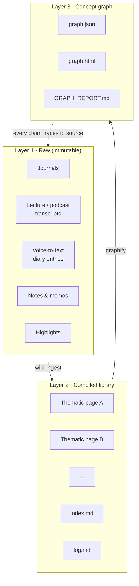

# Blueprint — Replication Spec

> You are reading the operational spec for the Enlightenment Machine. See [README](./README.md) for the human-facing overview of what this system is and why it matters.
>
> This file is written to be consumed by a capable coding agent (e.g. Claude Code) with filesystem access, long context, and tool use. If you are that agent, read this entire file end-to-end before taking any action, then follow the replication checklist in §9.

---

## 1 · Architecture



**Invariants:**
- Data flow is strictly one-directional. Raw is never rewritten.
- Upper layers are fully regenerable from lower layers. When wrong, discard and recompile — never patch in place.
- Every compiled sentence must carry a citation back to raw.

---

## 2 · Required tooling

| Component | Role | Required? |
|-----------|------|-----------|
| **Claude Code** or equivalent agent with long context + filesystem + shell | Executes the skills, performs compilation | Yes |
| **Markdown filesystem** (Obsidian / plain folder) | Holds raw + compiled text | Yes |
| **Git** | Version control of compiled layer; rollback on bad runs | Yes |
| **Python 3** with `networkx`, `python-louvain`, `pyvis` | Graph extraction, community detection, HTML rendering | Required for Layer 3 |
| **Scheduler** (launchd macOS / cron Linux / Task Scheduler Windows) | Daily & weekly automations | Required for a maintained system |
| **Transcription pipeline** (AssemblyAI / Whisper / etc.) | Audio → text for voice diaries, podcasts | Optional — only if ingesting audio |
| **Notion / Telegram / Gmail MCP servers** | Output surfacing, secondary ingestion | Optional |

---

## 3 · Directory layout

```
<knowledge-root>/
├── raw/                          # Layer 1 — NEVER MODIFIED
│   ├── journals/
│   │   └── YYYY-MM-DD.md
│   ├── transcripts/
│   │   └── <channel>/<year>/<month>/<slug>.md
│   ├── notes/
│   │   └── *.md                  # from Obsidian / Bear / etc.
│   └── voice/
│       └── *.txt                 # transcribed voice memos
├── wiki/                         # Layer 2 — regenerable
│   ├── index.md                  # TOC of all compiled pages
│   ├── log.md                    # append-only operations log
│   └── <category>/               # e.g. personal/, research/, finance/, work/, ...
│       └── <slug>.md
└── graph/                        # Layer 3 — regenerable from wiki/
    ├── graph.json
    ├── graph.html
    └── GRAPH_REPORT.md
```

Recommend: keep the whole tree under git so compile runs can be rolled back if an LLM output is bad.

---

## 4 · Required skills

A *skill* here is a named procedure the agent invokes. Each skill lives at `~/.claude/skills/<name>/SKILL.md` (or the equivalent path for your agent). Four skills are core. Others are optional extensions (§6).

### 4.1 `wiki-ingest` — raw source → compiled library

File: `~/.claude/skills/wiki-ingest/SKILL.md`

```markdown
---
name: wiki-ingest
description: Compile one raw source into the wiki. Updates 1–5 existing pages and/or creates new pages. Every claim carries a source citation.
---

# wiki-ingest

## Inputs
- `path` — absolute path to one raw source file

## Procedure
1. Read the raw source in full.
2. Read `wiki/index.md` to see what compiled pages exist.
3. Identify 1–5 pages the source contributes to. If a topic needs a new page, create it (and add to `index.md`).
4. For each affected page:
   a. Extract new key claims the source substantiates (facts, quotes, dates, conceptual moves).
   b. Append under the appropriate section with an inline citation `*(source-path, date-if-known)*`.
   c. Update cross-reference links to related pages.
5. Append a structured entry to `wiki/log.md`:
   - timestamp
   - source path
   - pages created / updated
   - number of claims added
   - summary of key additions
6. Do NOT modify the raw source.

## Rules (non-negotiable)
- Never mutate anything under `raw/`.
- Every factual claim added to a compiled page MUST have a source citation.
- When a new claim contradicts an existing compiled claim, preserve BOTH with a note — do not silently overwrite.
- Do not extrapolate beyond the raw source. If it didn't say it, don't claim it.
```

### 4.2 `wiki-query` — question → cited answer

File: `~/.claude/skills/wiki-query/SKILL.md`

```markdown
---
name: wiki-query
description: Answer a natural-language question about the subject's past by reading the compiled wiki and quoting with citations.
---

# wiki-query

## Inputs
- `question` — natural language

## Procedure
1. Read `wiki/index.md`.
2. Select 1–4 pages most relevant to the question.
3. Read those pages in full.
4. (Optional) Query the concept graph via the graphify MCP tools for cross-domain bridges relevant to the question.
5. Synthesize an answer using direct quotes + inline citations.
6. If the wiki has no material on the question, say so explicitly. Do NOT extrapolate from nothing.

## Rules
- No claim without a citation.
- Distinguish the subject's own statements from the assistant's interpretation.
- Prefer the subject's exact language over paraphrase where possible.
```

### 4.3 `wiki-lint` — integrity check

File: `~/.claude/skills/wiki-lint/SKILL.md`

```markdown
---
name: wiki-lint
description: Health-check the compiled wiki. Report missing citations, broken cross-refs, stale pages, orphaned pages, and cross-page contradictions.
---

# wiki-lint

## Procedure
1. Walk `wiki/` and collect all pages.
2. For each page:
   - Flag any factual-looking claim without a citation.
   - Check every outbound cross-reference link resolves.
   - Note last-updated date; flag pages stale beyond N days with new raw material in the domain.
3. Cross-page scan:
   - Detect the same claim asserted one way in page A, another way in page B. Report as potential contradiction.
4. List pages that are not linked from `index.md` (orphans).
5. List raw sources under `raw/` that appear never to have been ingested (use `log.md`).
6. Write the report to stdout. If `--fix` is passed, auto-fix only the safe categories (broken links, missing `index.md` entries). Leave contradictions and missing-citation issues for human review.
```

### 4.4 `graphify` — compiled library → concept graph

File: `~/.claude/skills/graphify/SKILL.md`

```markdown
---
name: graphify
description: Extract entities and relationships from the compiled wiki, cluster them, and emit a JSON + interactive HTML visualization.
---

# graphify

## Procedure
1. Read every page under `wiki/`.
2. Use the LLM to extract entities (concepts, people, works, places, time periods).
3. Use the LLM to extract relationships between entities. Label each edge as:
   - `EXTRACTED` — entities co-occur in a sentence expressing the relation explicitly
   - `INFERRED` — relation is the LLM's reading of the broader context; attach a confidence score
4. Run community detection (Louvain via `python-louvain`) over the resulting graph.
5. Write `graph/graph.json` — nodes, edges (with label + provenance), community assignments.
6. Render `graph/graph.html` as an interactive graph (pyvis or equivalent). Self-contained; no CDN deps (inline vis-network so the file works offline).
7. Write `graph/GRAPH_REPORT.md` with node count, edge count, extraction breakdown, top-degree hubs, community hub list.

## MCP tools to expose
When the graph is live, expose these tools via an MCP server for the agent to call from wiki-query and interactive sessions:
- `query_graph(question)` → relevant nodes + communities
- `get_neighbors(node)` → adjacent concepts
- `shortest_path(a, b)` → path through graph
- `god_nodes()` → top-degree hub concepts
- `get_community(id)` → cluster contents
- `graph_stats()` → summary numbers
```

---

## 5 · Scheduled automations

| Cadence | Task | Skill |
|---------|------|-------|
| On raw change (file watcher or daily sweep) | Ingest new raw files not yet in `log.md` | `wiki-ingest` |
| Daily | Regenerate graph if `wiki/` changed since last run | `graphify` |
| Weekly | Integrity check | `wiki-lint` |
| Weekly | Optional: generate a digest of the most interesting cross-domain edges found this week | `graphify` + prose |

Set these up using the platform's native scheduler:
- **macOS**: launchd plist in `~/Library/LaunchAgents/`
- **Linux**: `crontab -e`
- **Windows**: Task Scheduler

---

## 6 · Optional extensions

Not required for the core system. Natural once the core is running:

- **Voice diary pipeline.** Phone recording app → AssemblyAI/Whisper → append to `raw/journals/YYYY-MM-DD.md`. Then `wiki-ingest` picks it up on the next ingest sweep.
- **YouTube / podcast ingestion.** `yt-dlp` + transcription → `raw/transcripts/<channel>/<year>/<month>/*.md`. Then `wiki-ingest`.
- **Notion sync.** One-way push of compiled pages into a Notion database for mobile / cross-device reading.
- **Morning brief / weekly digest.** Small skill consulting the wiki + graph and emitting a summary to Telegram or email.
- **Domain dashboards.** Domain-specific compiled artifacts written to dedicated subdirectories of `wiki/` — e.g. portfolio state docs, health dashboards.

---

## 7 · Design principles (non-negotiable rules for the agent)

1. **Raw is sacred.** Never mutate a file under `raw/`. If raw needs correction, leave the original and write an errata file alongside.
2. **Every claim carries its source.** A compiled sentence without a citation is a bug.
3. **Regenerate, don't patch.** If the compiled layer is wrong structurally, discard and recompile. Never mutate silently.
4. **Name contradictions.** Never smooth disagreement between sources into a single averaged statement. Present both; flag the conflict.
5. **One-way flow.** Raw → compiled → graph. Never the other direction.
6. **Silent changes are a bug.** Every operation appends to `wiki/log.md`.
7. **Humans retain direction.** The agent arranges and connects. It does not decide what matters.
8. **Consent for ingestion.** Raw records are sensitive. Nothing is ingested without the user having explicitly confirmed the source list.

---

## 8 · Calibration — what "success" looks like

After an initial compile run against a user's records, expect:

| Raw volume | Compiled pages | Graph nodes | Graph edges |
|------------|----------------|-------------|-------------|
| ~50k words | 10–15 pages | ~200 | ~150 |
| ~150k words | 25–40 pages | ~500–700 | ~400–650 |
| ~500k+ words | 50+ pages | ~1000+ | ~800+ |

Rough rules of thumb — the exact numbers depend on how topic-diverse the records are. A compile run that produces dramatically fewer nodes than this suggests the LLM is over-compressing; dramatically more suggests it is double-counting entities.

---

## 9 · Replication checklist for a coding agent

If you are an agent handed this repo and tasked with setting up the Enlightenment Machine for a specific user, proceed in exactly this order:

```
[ ] 1. Confirm the user has ≥ 3 years of written personal material in
       some canonical location. Below that threshold, the system has
       too little to find.

[ ] 2. Ask the user's explicit consent before ingesting. These records
       are sensitive. Nothing is auto-ingested without approval.

[ ] 3. Pick a <knowledge-root> (e.g. ~/obsidian or ~/knowledge).
       Create the directory layout from §3. Move or symlink the
       user's existing raw material into raw/.

[ ] 4. Install the four core skills from §4 as SKILL.md files at
       ~/.claude/skills/<name>/SKILL.md. Verify each skill loads.

[ ] 5. Dry run — invoke wiki-ingest on ONE small source. Show the
       user the resulting compiled page(s). Verify:
       - every claim has a citation
       - cross-references resolve
       - log.md has an entry
       Get explicit confirmation before proceeding.

[ ] 6. Historical ingest — with consent, run wiki-ingest over the
       full raw corpus. This is the expensive step. Budget LLM cost
       accordingly. Parallelize where safe.

[ ] 7. Run graphify. Open graph.html. Verify the top-degree hubs
       look meaningful to the user. Adjust extraction prompts if
       hubs look wrong (usually due to overly generic entity names).

[ ] 8. Set up scheduled automations from §5. Use the platform's
       native scheduler.

[ ] 9. Demo wiki-query to the user. A good first query is something
       like "what have I said about X across the years" for some
       topic the user cares about. This is the system's primary
       interface.

[ ] 10. Hand the user §7 (design principles) and the "What it
        cannot reach" section of the README. Be explicit:
        - the tool's interpretations will sometimes be wrong
        - outsourcing the detection of one's own patterns can
          atrophy the capacity to notice them
        - the tool does not replace practice, teacher, or silence

[ ] 11. Commit the compiled wiki and graph to git. Tag the initial
        compile. This is the user's baseline.
```

---

## 10 · Failure modes to watch for

| Symptom | Likely cause | Fix |
|---------|--------------|-----|
| Compiled pages feel generic | LLM is summarizing instead of citing | Tighten the wiki-ingest prompt — demand direct quotes |
| Graph has a single giant hub node named "I" or "self" | Entity extraction collapsed all references to the subject | Add an extraction rule to skip the subject pronoun |
| Cross-references 404 | File slugs renamed but links not updated | Run wiki-lint with --fix |
| Log grows enormous | Every trivial edit logged | Keep log.md to significant operations only |
| Compiled layer drifts from raw | Silent edits made outside wiki-ingest | Enforce: no direct wiki/ edits. Only skills touch it |
| Graph never updates | Scheduler not firing, or graphify skipping unchanged check | Check scheduler logs; force-rebuild once |

---

End of blueprint.
