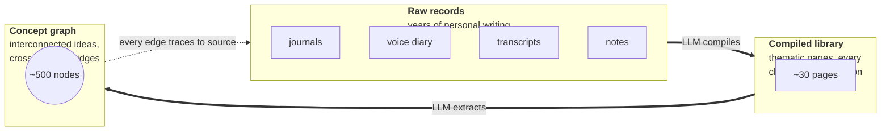
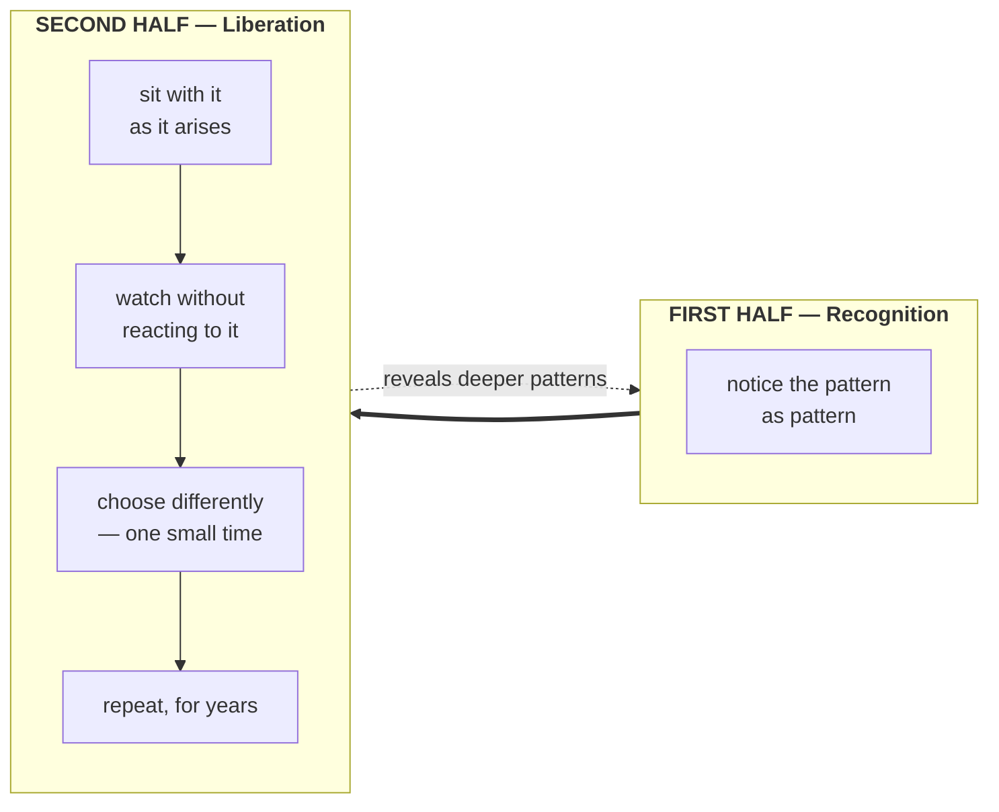
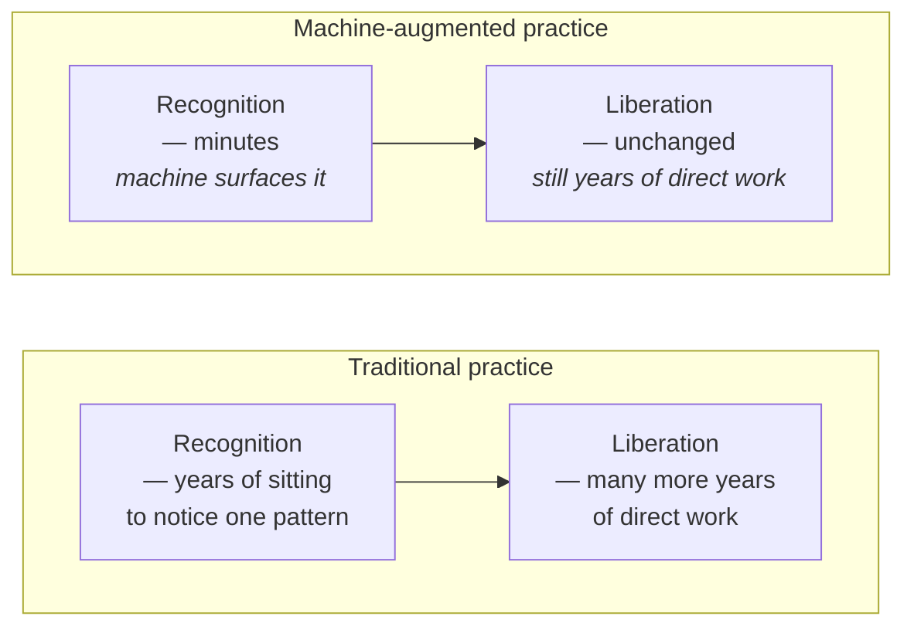

# The Enlightenment Machine

A blueprint for an AI-augmented system of self-reflection. Takes years of one person's personal records — journals, voice diaries, transcribed lectures, notes — and compiles them, via a large language model, into a thematic library and a concept graph the subject can consult *about themselves*.

Not a product. A pattern.

**→ For builders and agents: [BLUEPRINT.md](./BLUEPRINT.md)**

---

## What it does

Given enough personal writing over enough years, the machine compiles it into a small number of thematic pages, each threading what the subject has said about a concern across the full time range. Every sentence cites its source. A second pass builds a graph of concepts and the relationships between them, showing connections the subject never explicitly drew.

Asked a natural-language question — *"what did I say about X across these years?"* — it answers with quotations and dates.

## Patterns it tends to find

Run against any sufficiently long written record, the system tends to surface a small family of patterns. They keep showing up because each is an instance of the same underlying phenomenon: self-structures are durable, and this system is good at finding durability.

- **A sentence that survives decades.** A short self-diagnosis written at twenty-five, still operating at thirty-seven, nearly unchanged.
- **The same feeling, oppositely diagnosed.** Restlessness read as a *symptom* in one year, as a *signal* in another.
- **A belief refuted in writing that keeps operating.** The refutation is preserved; the behavior is not yet.
- **External observation vs. self-image.** A trusted observer's sharp remark placed beside a self-portrait from a different year. The contradiction is the data.
- **A ceiling exceeded but never erased.** An old estimate of personal limits, still on file, silently directing present decisions long after reality has walked past.

## The paradox

That a machine can read a person's records and reliably produce the repeating structures within them is itself a philosophical event. **A pattern that can be mechanically extracted is, precisely to that extent, a mechanical pattern.**

[Gurdjieff](https://en.wikipedia.org/wiki/George_Gurdjieff)'s tradition says most of what we call "I" is a machine; waking up begins with seeing it. The Buddhist tradition has named the same phenomenon for millennia — *[karma](https://en.wikipedia.org/wiki/Karma_in_Buddhism)*, *[vāsanā](https://en.wikipedia.org/wiki/V%C4%81san%C4%81)* (habit-energies). Both are claiming that the self, to a large degree, is conditioned repetition.

This system, unexpectedly, has become one of the most direct ways to map that territory. It shows the fossil (the repeating structure) and occasionally the crack (the moment it was interrupted). What it cannot show is the part that does the watching. That part remains the subject's work — and that work takes most of a lifetime.

## Pattern recognition as the first half of practice

The contemplative traditions broadly agree that liberation — awakening, [*mokṣa*](https://en.wikipedia.org/wiki/Moksha), enlightenment — is a *gradual process*, not a single event. It has two halves:

1. **Recognition.** Becoming aware of one's own patterns: the habitual reactions, identifications, repeating grooves of thought, feeling, and behavior. *Until you see a pattern as pattern, you are still inside it.*
2. **Liberation.** The slow loosening of those patterns through repeated, direct seeing. *Noticing a pattern once is not the same as being free of it.* Freedom is built by meeting the same pattern again and again, each time with slightly less identification, slightly more space around it.

Zen makes this split explicit — [*kenshō*](https://en.wikipedia.org/wiki/Kensh%C5%8D) (initial seeing) is not *satori* (the long integration). The Theravāda's [four stages of enlightenment](https://en.wikipedia.org/wiki/Four_stages_of_awakening) are a graded sequence of seeing-through: stream-entry, once-returner, non-returner, arhat. Korean Seon formalized [*sudden awakening / gradual cultivation*](https://en.wikipedia.org/wiki/Subitism) as its central pedagogical position. Gurdjieff's Fourth Way treats "self-remembering" as a daily practice, never a destination. None of these traditions expect the work to be a single moment. They expect it to be sustained over a lifetime — a gradual cultivation.

## Where the machine fits

This system operates almost entirely in the first half. It **accelerates pattern recognition** — the part of the work that asks the practitioner to notice what is running underneath daily life:

- A pattern that would have taken years of sitting to notice can be surfaced in minutes, because the machine has read everything at once and can count occurrences across a decade.
- Patterns that span unrelated domains (finance and fear, work and family) become visible immediately, because the machine has no category loyalty.
- Patterns that would be invisible through sheer volume — thirty-seven mentions of the same fear across fifteen years — become trivially countable.

The machine cannot do the second half. It cannot make the subject *free* of a pattern. Freedom is built by direct experience — sitting with the pattern as it arises, watching it without acting on it, choosing differently one small time at a time. The machine can *show* the pattern; the practitioner has to *dissolve* it through practice.

The gift is real — pattern recognition accelerated by orders of magnitude. The liberation phase is unchanged. No machine has ever shortened it, and the idea that one could is itself a pattern worth watching for.

## Risks built into the gift

Three traps, each worth naming:

1. **Conflating seeing with freedom.** A subject may read the machine's report — *"here is the eleventh year of this pattern"* — and feel that the reading *is* the work. It isn't. The reading is one small piece of the recognition half. The liberation half still requires sitting.
2. **Outsourcing the recognition muscle.** Classical practice builds self-awareness as a capacity in the body — a way of noticing one's own thoughts and reactions *in real time*. If recognition is handed off to a machine, the capacity may atrophy. The traditions trained the practitioner to become their own pattern detector. A practitioner who cannot spot a pattern without their AI is a weaker practitioner, not a stronger one.
3. **The machine's patterns aren't the only patterns.** A subject who trusts the machine too much will only work on the patterns it surfaces. Patterns that don't show up in writing — pre-verbal reactivity, somatic holdings, the quality of one's presence, the micro-textures of relationship — remain invisible to the tool, and therefore, if the subject is not careful, invisible to the subject.

## What the tool cannot reach

Designed in, not pending:

- **The body.** Breath, posture, held tension — untranslated into text.
- **The present moment.** Records are past. Presence is now.
- **Silence.** The system operates in language; the heart of practice is often where language stops.
- **Watching itself.** It can count patterns; it cannot be the act of seeing through one.
- **Transmission.** What passes between teacher and student is pre-verbal and does not survive in notes.

However rich this kind of system becomes, it does not replace the teacher, the practice, or the silence.

## Nevertheless

Used carefully, the tool shortens the *recognition* phase — leaving the practitioner more time and energy for the *liberation* phase that no machine can perform for them.

The old teachers used to say: you cannot step outside a machine you have not first admitted you are inside. If a modern machine can help you admit — concretely, with dated citations — that you are inside a particular pattern, that is a real gift. What you do with the admission is the work that has always been there, and that every sincere lineage has described in nearly the same words: you sit, you watch, you return, you sit again.

## Who might build this

- Anyone with ~3+ years of written personal material and the patience to design the compile prompts carefully.
- Anyone who has noticed that their memory of their past is continually edited by the present mood, and would like an immovable record to consult.
- Anyone curious about the automation of inner observation and willing to think about what that automation displaces.

## Related work & references

- [**Karpathy's LLM Wiki**](https://gist.github.com/karpathy/442a6bf555914893e9891c11519de94f) — **the direct ancestor.** Andrej Karpathy's April 2026 gist laying out the pattern of an LLM-maintained, incrementally-compiled personal wiki that sits between you and your raw notes. This blueprint is largely an operationalization of that idea with added structure for the raw/compiled/graph layers, concept-graph extraction, scheduled maintenance, and agent-driven replication.
- [*Building a Second Brain*](https://www.buildingasecondbrain.com/book) (Tiago Forte, 2022) — the contemporary Second Brain movement this system extends
- [Zettelkasten](https://en.wikipedia.org/wiki/Zettelkasten) — Niklas Luhmann's ~90,000-card method from the 1960s, the distant ancestor of this pattern
- [Obsidian](https://obsidian.md/), [Roam](https://roamresearch.com/), [Notion](https://notion.so/) — contemporary personal-knowledge tools that implement Layer 1–2 manually
- [graphify](https://github.com/safishamsi/graphify) — the reference implementation this system's `graphify` skill wraps (by Safi Shamsi)
- [Claude Code](https://www.anthropic.com/claude-code) — the agent this blueprint is written for; any comparable long-context, tool-using agent works

---

## Building it

The operational spec — directory layout, skill definitions, schedules, agent replication checklist — lives in a separate file, written to be consumed by a capable coding agent:

### **[→ BLUEPRINT.md](./BLUEPRINT.md)**

Hand that file plus access to a user's records to Claude Code (or an equivalent agent), and the system can be stood up end-to-end.

---

## License

[MIT](./LICENSE). Do what you want with it.

## Anonymity

Released without an author. The content should stand or fall on its own merits.
